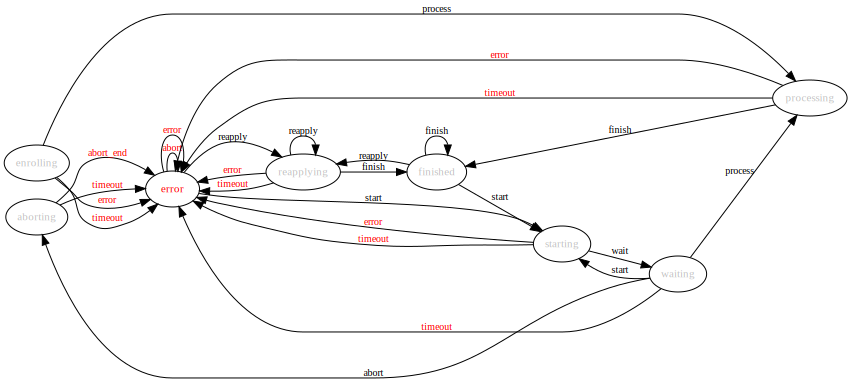

How Ironic Inspector Works
==========================

Workflow
--------

Usual hardware introspection flow is as follows:

* Operator enrolls nodes into Ironic_ e.g. via `openstack baremetal CLI`_
  command. Power management credentials should be provided to Ironic at this
  step.

* Nodes are put in the correct state for introspection as described in
  :ref:`node states <node_states>`.

* Operator sends nodes on introspection using **ironic-inspector** API or CLI
  (see :ref:`usage <usage_guide>`).

* On receiving node UUID **ironic-inspector**:

  * validates node power credentials, current power and provisioning states,
  * allows access to PXE boot service for the nodes,
  * issues reboot command for the nodes, so that they boot the ramdisk.

* The ramdisk collects the required information and posts it back to
  **ironic-inspector**.

* On receiving data from the ramdisk, **ironic-inspector**:

  * validates received data,
  * finds the node in Ironic database using it's BMC address (MAC address in
    case of SSH driver),
  * fills missing node properties with received data and creates missing ports.

  .. note::
    **ironic-inspector** is responsible to create Ironic ports for some or all
    NIC's found on the node. **ironic-inspector** is also capable of
    deleting ports that should not be present. There are two important
    configuration options that affect this behavior: ``add_ports`` and
    ``keep_ports`` (please refer to :doc:`the sample configuration file
    </configuration/sample-config>` for a detailed explanation).

    Default values as of **ironic-inspector** 1.1.0 are ``add_ports=pxe``,
    ``keep_ports=all``, which means that only one port will be added, which is
    associated with NIC the ramdisk PXE booted from. No ports will be deleted.
    This setting ensures that deploying on introspected nodes will succeed
    despite `Ironic bug 1405131
    <https://bugs.launchpad.net/ironic/+bug/1405131>`_.

    Ironic inspection feature by default requires different settings:
    ``add_ports=all``, ``keep_ports=present``, which means that ports will be
    created for all detected NIC's, and all other ports will be deleted.
    Refer to the `Ironic inspection documentation`_ for details.

    Ironic inspector can also be configured to not create any ports. This is
    done by setting ``add_ports=disabled``. If setting ``add_ports`` to disabled
    the ``keep_ports`` option should be also set to ``all``. This will ensure
    no manually added ports will be deleted.

.. _Ironic inspection documentation: https://docs.openstack.org/ironic/latest/admin/inspection.html

* Separate API (see :ref:`usage <usage_guide>` and :ref:`api <http_api>`) can
  be used to query introspection results for a given node.

* Nodes are put in the correct state for deploying as described in
  :ref:`node states <node_states>`.

Starting DHCP server and configuring PXE boot environment is not part of this
package and should be done separately.

State machine diagram
---------------------

.. _state_machine_diagram:

The diagram below shows the introspection states that an **ironic-inspector**
FSM goes through during the node introspection, discovery and reprocessing.
The diagram also shows events that trigger state transitions.

.. _Ironic: https://wiki.openstack.org/wiki/Ironic
.. _openstack baremetal CLI: https://docs.openstack.org/python-ironicclient/latest/cli/osc_plugin_cli.html
